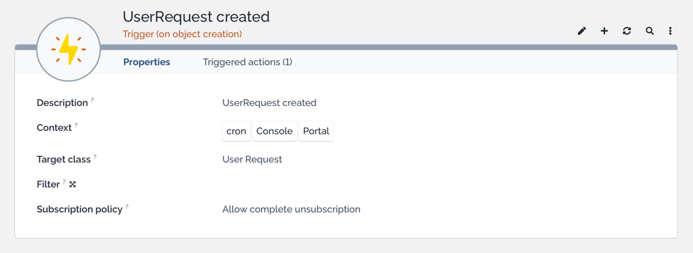
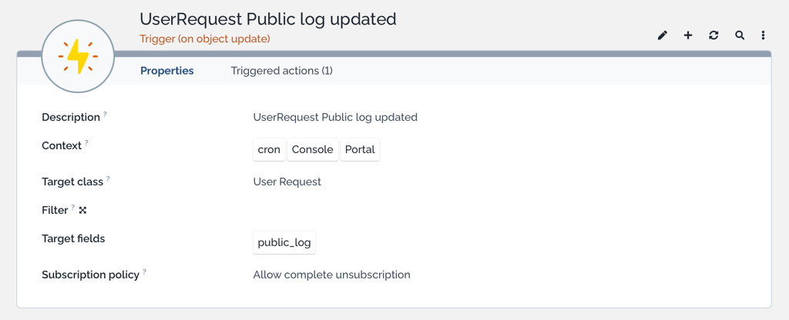
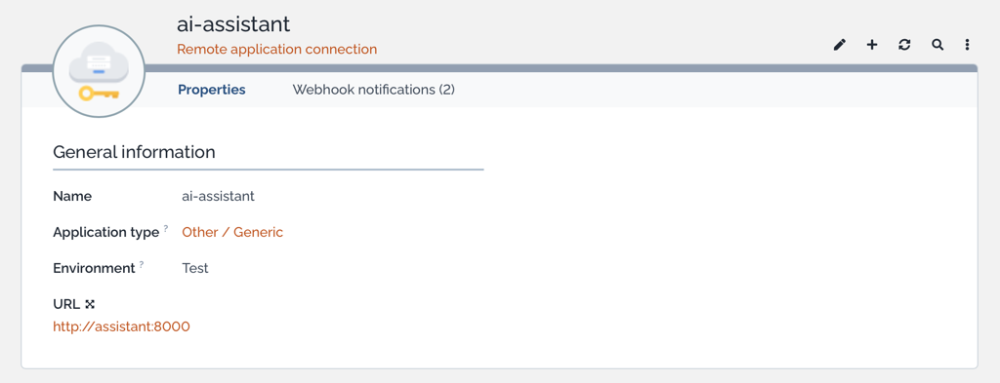
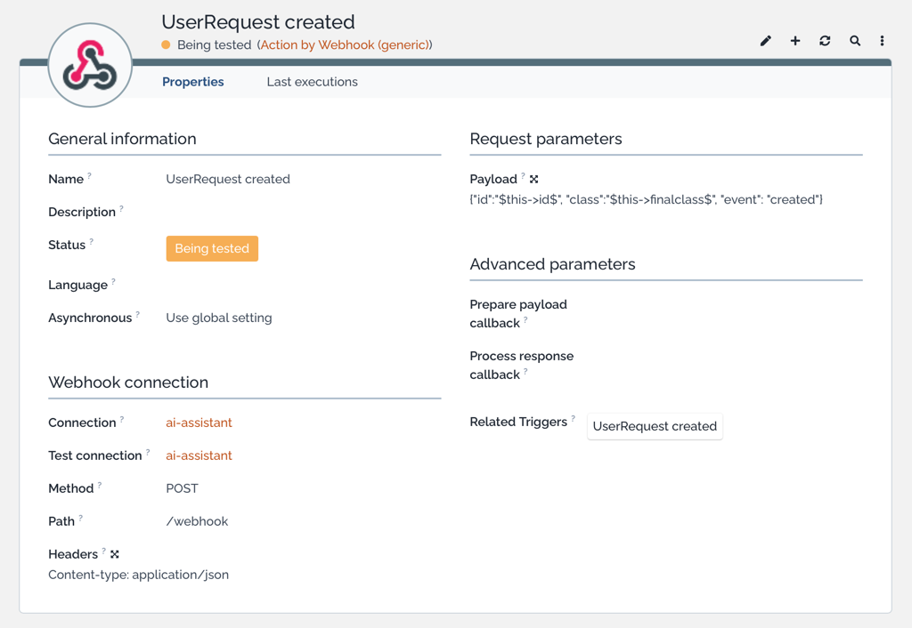
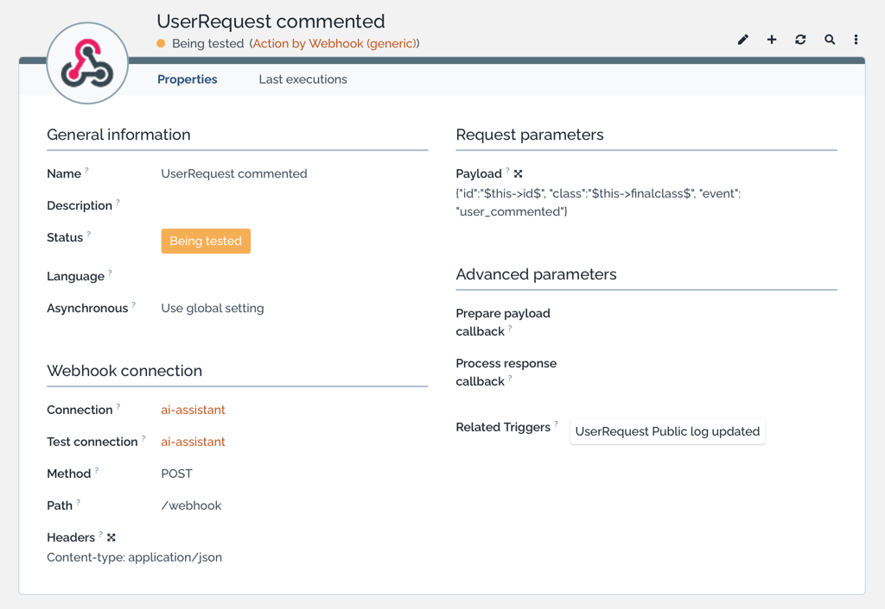
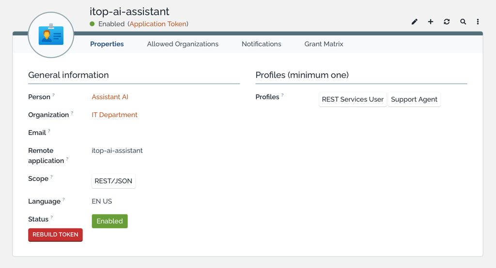

# iTop AI Assistant

AI-powered middleware for [Combodo iTop](https://www.itophub.io/) that reduces ticket back-and-forth and helps engineers start working faster.

---

## The problem

Engineers waste time on tickets that arrive without enough information: vague descriptions, missing hardware details, no steps to reproduce. Before any work can start, they have to write back to the user and wait. This creates delays, drops SLA metrics and frustrates everyone.

---

## How it works

> **The engineer sees the ticket only when it's ready to work on.**

When a new ticket arrives, the assistant intercepts it via webhook — no changes to iTop itself are needed. It works in two stages:

1. **Classify** — if the ticket has no service or subcategory set, the assistant queries iTop for the available options and picks the best match based on the title and description. If it cannot determine the right category confidently, it posts one clarifying question in the public log and waits for the user to reply.

2. **Evaluate** — once the category is known, the assistant uses the subcategory's description as the completeness criteria. This means the questions it asks are specific to the service context, not generic prompts.

- If the description is **complete** — it generates a structured internal note for the engineer and marks the ticket ready.
- If the description is **incomplete** — it posts one focused clarifying question in the iTop public log. The user replies through the portal as usual, the assistant re-evaluates and either asks one follow-up or proceeds to enrich. Maximum two rounds per stage.

All AI actions are performed under a dedicated iTop service account, so every comment is clearly attributed and auditable.

### Examples

**Scenario 1 — incomplete ticket**

A user opens a ticket in the service portal:
> **Title:** printer broken  
> **Description:** Not printing.

The service subcategory is *Hardware*, which requires: device model, OS and exact error. The description provides none of this. The assistant posts in the public log within seconds:

> **AI Assistant**
>
> Thank you for reaching out! To help us resolve this quickly, could you please provide:
> — the manufacturer and model of the printer (e.g. HP LaserJet 400 M401dn);
> — your operating system and version;
> — the exact error message or what happens when you try to print.

**Scenario 2 — complete ticket**

Another user submits:
> **Title:** HP LaserJet 400 M401dn not printing after Windows 11 update  
> **Description:** My HP LaserJet 400 M401dn stopped printing after a Windows 11 update yesterday evening. Error: "Driver unavailable". Already restarted both printer and PC.

All required fields are present. No question is asked. Instead, the engineer immediately sees an internal note:

> **AI Assistant** (internal note)
>
> **Issue:** HP LaserJet 400 M401dn stopped printing after a Windows 11 update. Error: "Driver unavailable".  
> **Already tried:** Restarted printer and PC.  
> **Suggested next step:** Reinstall or update the printer driver from HP's website; check if Windows Update pushed an incompatible driver version.

### The flow

```
Ticket created          User commented
        │                       │
        └──────────┬────────────┘
                   │
                   ▼
         Already processed?  ──yes──▶  stop
         Engineer assigned?  ──yes──▶  stop
                   │ no
                   ▼
        Service/subcategory set?
                   │
        ┌──────────┴──────────────────────┐
        │ yes                             │ no
        │                                 ▼
        │                    LLM picks category from iTop
        │                                 │
        │                    ┌────────────┴──────────┐
        │                    │ confident              │ unsure
        │                    ▼                        ▼
        │             category set        Ask clarifying question
        │                    │            in public log,
        │                    │            wait for reply
        │                    │            (triggers new webhook)
        └──────────┬─────────┘
                   ▼
        Is description sufficient?
                   │
        ┌──────────┴──────────────┐
        │ yes                     │ no
        ▼                         ▼
Post internal note          Ask clarifying question
for engineer                in public log,
        │                   wait for user reply
        │                   (triggers new webhook)
        │
        ▼
Mark ticket processed
```

---

## Requirements

- iTop 3.x with REST API enabled
- Redis
- OpenAI-compatible LLM endpoint (local or cloud)

---

## Quick start

**Prerequisites:** Docker and an OpenAI-compatible LLM endpoint (local or cloud).

Copy `docker-compose.yml` and `.env.dist` from this repository, then:

```bash
cp .env.dist .env   # optional: pre-fill anything you already know
docker compose up -d
```

The compose file pulls `ghcr.io/knowitop/itop-ai-assistant` and starts iTop, Redis and the assistant together. If you already have an iTop or Redis instance, comment out the service in `docker-compose.yml`.

Once running:

| Service   | URL (host)                  |
|-----------|-----------------------------|
| iTop      | `http://localhost:8000`     |
| Assistant | `http://localhost:8001`     |
| Admin UI  | `http://localhost:8001/ui`  |
| API docs  | `http://localhost:8001/docs`|

The assistant starts **unconfigured**: it is up, `/health` and the admin API work, but `/webhook` returns 503 until the LLM and iTop connections are set. Configure it either way:

- **Setup wizard (recommended).** Open `http://localhost:8001/ui` — the wizard starts automatically on an unconfigured system and walks through the security tokens, the iTop connection and the LLM connection, with a connection probe on every step; the final step can create the iTop-side triggers and webhooks for you (asks for one-time iTop admin credentials). No restart needed. See [Admin UI](#admin-ui).
- **Setup API.** The same backend without the UI — open `http://localhost:8001/docs` and walk through `/api/setup`:
  1. `GET /api/setup/status` — shows what is still missing;
  2. `PATCH /api/setup/llm` `{"model": "...", "base_url": "...", "api_key": "..."}` and `POST /api/setup/test-llm` to verify;
  3. `PATCH /api/setup/itop` `{"url": "...", "token": "..."}` and `POST /api/setup/test-itop` to verify;
  4. `PATCH /api/setup/security` `{"admin_token": "...", "webhook_token": "..."}` — after this the admin API requires the token (`Authorization: Bearer <token>`).
- **Environment.** Fill `.env` and `docker compose up -d` again — env values act as defaults for the same settings.

> The iTop service account and its token (see [iTop configuration](#itop-configuration) step 4) can only be created after iTop is up — runtime setup makes this a single flow: start the stack, create the account in iTop, then `PATCH /api/setup/itop`.

---

## iTop configuration

Four steps, roughly 10 minutes.

Steps 2 and 3 (triggers and webhooks) can be automated: the setup wizard's
**iTop webhooks** step — or the CLI below — creates the same objects through
the iTop REST API under one-time admin credentials (used for that run only,
never stored). Existing objects are left untouched, so re-running is safe.
The manual instructions stay as the reference for what gets created.

```bash
# from a local checkout
cd assistant && PYTHONPATH=src uv run python -m itop_provisioning \
  --itop-url http://localhost:8000/webservices/rest.php --user admin \
  --backend-url http://assistant:8000 --webhook-token <WEBHOOK_TOKEN>

# or inside the Docker stack
docker compose exec assistant python -m itop_provisioning \
  --itop-url http://itop/webservices/rest.php --user admin \
  --backend-url http://assistant:8000 --webhook-token <WEBHOOK_TOKEN>
```

`--backend-url` is the assistant as reachable **from the iTop server** (in the
bundled compose stack that is `http://assistant:8000`); `--webhook-token` must
match the `security` section so iTop's calls pass authentication.

### 1. Configure service subcategories

The assistant uses the **description** field of each service subcategory as its completeness criteria — it checks whether the ticket contains everything listed there before deciding to ask a question or proceed to enrichment.

Go to each subcategory you want the assistant to handle and write a short description of what information is required:

> Hardware equipment failures and malfunctions.  
> Required information: device manufacturer and model, operating system, exact error message or failure symptom.

Keep it factual and specific — the more precise the description, the better the questions the assistant will ask.

### 2. Set up triggers

Create two triggers in iTop (**Configuration → Notifications → Triggers**):

**Trigger 1 — ticket created:**

| Field        | Value                        |
|--------------|------------------------------|
| Type         | Trigger (on object creation) |
| Target class | `UserRequest`                |
| Context      | `cron`, `Console`, `Portal`  |

> Set the context to `cron`, `Console`, and `Portal` only — **do not include `REST/JSON`**. This prevents the trigger from firing on updates made by the assistant itself via the API, which would cause a loop.



**Trigger 2 — user commented:**

| Field         | Value                       |
|---------------|-----------------------------|
| Type          | Trigger (on object update)  |
| Target class  | `UserRequest`               |
| Context       | `cron`, `Console`, `Portal` |
| Target fields | `public_log`                |



### 3. Set up webhooks

In iTop, go to **Configuration → Webhooks → Remote Application Connections** and add a new connection for the assistant.

If you set `WEBHOOK_TOKEN` in `.env` (recommended), configure the connection to send that value in the `X-Auth-Token` header — requests without it are rejected with 401.



For each trigger, create a **Webhook action** that sends `POST http://assistant:8000/webhook` with the corresponding JSON body:

**Webhook 1 — ticket created:**

```json
{"id": "$this->id$", "class": "$this->finalclass$", "event": "created"}
```



**Webhook 2 — user commented:**

```json
{"id": "$this->id$", "class": "$this->finalclass$", "event": "user_commented"}
```



### 4. Create a service account

Create a dedicated iTop user account for the assistant (**Administration → User accounts**). Use **Application Token** authentication — no password needed.



Use this account's credentials for `ITOP_TOKEN` (or `ITOP_USER` / `ITOP_PWD`) in your `.env`. All comments posted by the assistant will appear under this account, making AI actions clearly visible and auditable in the ticket log.

---

## Admin UI

The assistant ships with a built-in admin UI at `http://localhost:8001/ui` — everything below is also available via the [admin API](#admin-api), the UI is just the friendlier way in.

- **Setup** — the first-run wizard (security tokens → iTop → LLM → iTop webhooks, each step with a live connection test); the optional webhooks step provisions the iTop-side triggers and webhooks under one-time admin credentials. On a configured system, a status summary with the option to re-run the wizard.
- **Connections** — fine-grained editing of the `itop`, `llm`, `security` and `ticket_mapping` sections: secrets are write-only (shown as "set"/"not set"), every change can be probed before saving, and each section can be reset back to its environment defaults. The iTop tab also hosts the same webhook-provisioning form as the wizard.
- **Modules** — per-module business settings (question round limits, per-node model overrides, OQL scoping) on forms generated from the config schema; changes apply from the next processed ticket.
- **Prompts** — view and edit every LLM prompt, with overridden ones flagged; placeholder validation errors are shown on save, and any prompt can be reset to its default.
- **Runs** — the processing journal: filterable list of runs with a step-by-step timeline and full error text for each, auto-refreshing while a run is in progress.

Authentication uses the admin token (`Authorization: Bearer`) — the UI asks for it once and keeps it in the browser's localStorage. Until a token is set the API is open (first-run mode), which is what lets the wizard bootstrap a clean install; the wizard's security step closes it.

---

## Configuration

Settings resolve in priority order: **runtime overrides (setup API, stored in Redis) → environment / `.env` → built-in defaults**. Env vars remain the IaC-friendly path; the setup API edits the same settings at runtime without a restart. Only the bootstrap values (`REDIS_URL`, host/port, `LOG_LEVEL`, `PROMPTS_DIR`) are env-only.

A full `.env` template with examples is in `docker/.env.dist`.

| Variable | Required | Description |
|----------|----------|-------------|
| `LLM_MODEL` | yes — env or setup API | Model name as exposed by the endpoint |
| `ITOP_USER` + `ITOP_PWD` | one of — env or setup API | iTop basic auth — use this or `ITOP_TOKEN` |
| `ITOP_TOKEN` | one of — env or setup API | iTop personal/app token — use this or basic auth |
| `LLM_BASE_URL` | default `http://localhost:1234/v1` | OpenAI-compatible LLM endpoint |
| `LLM_API_KEY` | optional | API key — omit entirely for local LM Studio |
| `ITOP_URL` | default `http://localhost/webservices/rest.php` | iTop REST API URL |
| `WEBHOOK_TOKEN` | recommended | Shared secret for `/webhook`; iTop must send it in the `X-Auth-Token` header. Unset = unauthenticated access |
| `ADMIN_TOKEN` | recommended | Bearer token for the `/api` admin endpoints (`Authorization: Bearer <token>`). Unset = unauthenticated access |
| `REDIS_URL` | default `redis://localhost:6379` | Redis connection URL (bootstrap, env-only) |
| `PROMPTS_DIR` | optional | Directory with prompt overrides (see below; env-only) |
| `LOG_LEVEL` | default `INFO` | Logging level (env-only) |

`LLM_BASE_URL` accepts any OpenAI-compatible endpoint: [LM Studio](https://lmstudio.ai/) for local models, [LiteLLM Proxy](https://docs.litellm.ai/) to front any cloud provider or OpenAI directly.

> Runtime overrides (including secrets set through the setup API) live in Redis — the bundled `docker-compose.yml` already enables Redis persistence (`appendonly yes` + volume) so they survive restarts. Keep Redis unreachable from outside the stack. To recover a lost admin token, delete the `config:security` key in Redis or set `ADMIN_TOKEN` in the environment.

### Adapting to a customized iTop datamodel

If your iTop uses renamed attributes, extra ticket classes or a custom
lifecycle, adjust the `ticket_mapping` section — in `config.yaml`, or at
runtime via `PATCH /api/setup/ticket_mapping` — no code changes needed:

```yaml
ticket_mapping:
  fields:                      # semantic field -> your attribute code
    caller_name: "contact_friendlyname"
  class_overrides:             # per-class differences (null = attribute absent)
    Incident:
      request_type: null
  active_statuses: ["new", "approved"]   # when the assistant may act
```

Unspecified fields keep their stock-iTop defaults.

### Admin API

The assistant exposes a small admin API (bearer auth: `Authorization: Bearer <token>`) — the backend behind the [admin UI](#admin-ui). Until an admin token is set (env `ADMIN_TOKEN` or `PATCH /api/setup/security`), the API is **open** — first-run mode for the setup wizard; set the token before exposing the service:

| Endpoint | Purpose |
|----------|---------|
| `GET /health` | Liveness + Redis connectivity |
| `GET /api/setup/status` | Setup state: what is configured, what is still missing |
| `GET/PATCH/DELETE /api/setup/{section}` | Connection sections (`itop`, `llm`, `security`, `ticket_mapping`): read (secrets masked) / partial update / reset to env defaults. In PATCH bodies, an absent field keeps the stored value; an explicit `null` clears it |
| `POST /api/setup/test-itop`, `POST /api/setup/test-llm` | Probe a connection (stored config merged with body overrides) without saving anything |
| `POST /api/setup/provision-itop` | Create the iTop-side triggers and webhooks (find-or-create). One-time admin credentials in the body, never stored; uses the saved webhook token |
| `GET /api/modules` | Registered business modules |
| `GET/PUT/DELETE /api/config/{module}` | Read / edit / reset module config at runtime (validated; applies from the next ticket, no restart) |
| `GET /api/config/{module}/schema` | JSON Schema of the module config (for form generation) |
| `GET /api/prompts/{module}` | Effective prompts + which are overridden |
| `PUT/DELETE /api/prompts/{module}/{name}` | Edit / reset a single prompt (placeholders validated before saving) |
| `GET /api/runs`, `GET /api/runs/{id}` | Processing-run journal: status, per-node steps, errors |

The `processing_id` returned by `/webhook` is the key into `/api/runs/{id}`.

### Customizing prompts

All LLM prompts are plain text templates shipped in [`assistant/prompts/enrichment/`](assistant/prompts/enrichment). To adapt them to your organization, set `PROMPTS_DIR` to a directory of your own and place files with the same names under `<PROMPTS_DIR>/enrichment/` — each file overrides one prompt, the rest keep their defaults:

```
my-prompts/
└── enrichment/
    └── evaluate_system.md   # overrides only this prompt
```

Templates use `{placeholder}` variables (e.g. `{title}`, `{description}`, `{caller_name}`). The service validates all templates at startup and refuses to start if a template references an unknown placeholder, so typos surface immediately instead of breaking live tickets. Edits to prompt files apply from the next processed ticket — no restart needed.

---

## Roadmap

The current release covers the first-contact enrichment loop — intercepting new tickets, asking clarifying questions and preparing them for the engineer. Planned next phases:

- **Pattern analysis** — background jobs that surface recurring issues and trends across tickets.
- **Knowledge base maintenance** — automatically flag outdated KB articles and suggest updates based on resolved tickets.
- **Change Management review** — AI-assisted risk and impact assessment for RFCs.
- **Engineer widget** — contextual AI sidebar inside the iTop UI showing similar past tickets and suggested actions.
- **User memory** — persistent context per user across tickets: no repeated questions about device or department, automatic adaptation to technical vs. non-technical communication style and pattern detection across a user's ticket history.

Feedback and ideas are welcome in [GitHub Issues](../../issues).

---

## Local development

Requires [uv](https://docs.astral.sh/uv/).

```bash
cd assistant
uv sync
cp docker/.env.dist .env   # fill in LLM and iTop settings
uvicorn src.main:app --host 0.0.0.0 --port 8001 --reload
```

### Running tests

```bash
cd assistant
uv run pytest              # unit tests
uv run pytest --cov=src    # with coverage report
```

### Admin UI development

Requires Node.js. The dev server proxies `/api` and `/health` to the assistant on `:8001`, so run the backend alongside it:

```bash
cd ui
npm ci
npm run dev     # dev server with hot reload, open the printed URL
npm run build   # production build into ui/dist — FastAPI serves it at /ui
```

---

## License

[AGPL-3.0](LICENSE)