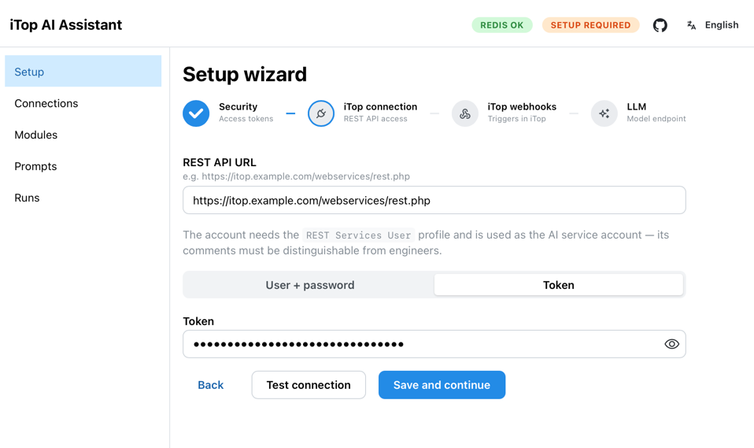

# iTop AI Assistant

[](https://github.com/knowitop/itop-ai-assistant/actions/workflows/ci.yml)
[](https://codecov.io/gh/knowitop/itop-ai-assistant)

AI-powered middleware for [Combodo iTop](https://www.itophub.io/) that reduces ticket back-and-forth and helps engineers start working faster.

---

## The problem

Engineers waste time on tickets that arrive without enough information: vague descriptions, missing hardware details, no steps to reproduce. Before any work can start, they have to write back to the user and wait. This creates delays, drops SLA metrics and frustrates everyone.

---

## How it works

> **The engineer sees the ticket only when it's ready to work on.**

When a new ticket arrives, the assistant intercepts it via webhook — there is no extension to install into iTop. Processing runs as a **single AI agent** that decides what the ticket needs and acts through a fixed set of tools:

- **Classify** — if the ticket has no service or subcategory, the agent reads the service catalog from iTop and writes the best match back to the ticket. The classification tools validate every id against the catalog, so the agent cannot invent a category.
- **Ask** — if the ticket is too vague to classify or to work on, the agent posts exactly **one** focused clarifying question in the public log and stops. The user replies through the portal as usual, which triggers a new webhook and a fresh round. By default three questions per ticket at most, of which at most two may be spent on working out its category, then the ticket moves on with whatever is available.
- **Hand off** — once the picture is clear, the agent writes a structured internal note for the engineer and marks the ticket done.
- **Quote what already worked** — where a vector index is configured, the note carries references to similar solved tickets. Only what iTop still shows the run gets quoted, and internal correspondence never does.

The subcategory's own **description** in iTop is what the agent treats as the completeness criteria — so the questions it asks are specific to the service context, not generic prompts.

Each of the four actions has its own switch: a deployment that only wants routing, or only wants the engineer's summary, turns off the rest. A switched-off action is not asked to be skipped — its tool is never handed to the model, so it cannot happen at all ([which actions the module performs](docs/configuration.md#which-actions-the-module-performs)).

The agent decides the order; the tools enforce the rules. The round limits, the "one question per run" rule and the "stop once an engineer takes the ticket" guard are plain code, not instructions in a prompt — a model that misbehaves gets its call rejected rather than the ticket damaged.

All AI actions are performed under a dedicated iTop service account, so every comment is clearly attributed and auditable.

### Examples

**Scenario 1 — incomplete ticket**

A user opens a ticket in the service portal:
> **Title:** printer broken  
> **Description:** Not printing.

The service subcategory is *Hardware*, which requires: device model, OS and exact error. The description provides none of this. The assistant posts in the public log within seconds:

> **AI Assistant**
>
> Thank you for reaching out! To help us resolve this quickly, could you please provide:  
> — the manufacturer and model of the printer (e.g. HP LaserJet 400 M401dn);  
> — your operating system and version;  
> — the exact error message or what happens when you try to print.

**Scenario 2 — complete ticket**

Another user submits:
> **Title:** HP LaserJet 400 M401dn not printing after Windows 11 update  
> **Description:** My HP LaserJet 400 M401dn stopped printing after a Windows 11 update yesterday evening. Error: "Driver unavailable". Already restarted both printer and PC.

All required fields are present. No question is asked. Instead, the engineer immediately sees an internal note:

> **AI Assistant** (internal note)
>
> **Issue:** HP LaserJet 400 M401dn stopped printing after a Windows 11 update. Error: "Driver unavailable".  
> **Already tried:** Restarted printer and PC.  
> **Suggested next step:** Reinstall or update the printer driver from HP's website; check if Windows Update pushed an incompatible driver version.

### The flow

```
Ticket created           User commented
       │                        │
       └───────────┬────────────┘
                   │
                   ▼
┌─ guard (plain code) ──────────────────────────────┐
│  Already processed?      ──yes──▶  stop           │
│  Engineer assigned?      ──yes──▶  stop           │
│  Last comment was ours?  ──yes──▶  stop           │
└─────────────────────────┬─────────────────────────┘
                          │ no
                          ▼
┌─ agent session ───────────────────────────────────┐
│  In the prompt: the ticket, the conversation,     │
│  plus the service catalog while the ticket is     │
│  still unclassified.                              │
│                                                   │
│  The agent picks a tool, the tool enforces:       │
│                                                   │
│   classify    service + subcategory checked       │
│               against the catalog, then the       │
│               session continues                   │
│   ask         one question in the public log,     │
│               session ends                        │
│   hand off    internal note for the engineer,     │
│               session ends                        │
└─────────────────────────┬─────────────────────────┘
                          ▼
Ticket marked processed, or left waiting for a reply
that arrives as the next webhook
```

---

## What you get around it

- **A setup wizard**, not a configuration file — security, iTop connection, webhook provisioning and the model, in four steps. Everything it sets can be re-edited later from the admin UI, and applies from the next ticket without a restart. ([Setup](docs/setup.md))
- **Dry run** — the assistant processes your live queue exactly as it would in production, records every decision, and writes nothing to iTop. Watch it work on your own tickets, then decide. ([Dry run](docs/configuration.md#dry-run))
- **A run journal** — every run, step by step: each model turn, each tool call and its result, tokens and wall time, with the full text of the question or note it would have posted. ([Runs](docs/admin-ui.md#runs))
- **Optional self-hosted LLM tracing** — the prompt and the raw model answer, exported over OTLP to a receiver you run yourself. Off by default; the bundled stack ships one behind a compose profile. ([LLM tracing](docs/configuration.md#llm-tracing))
- **Your model, your infrastructure** — OpenAI, Google Gemini, Ollama, or any OpenAI-compatible endpoint, including a model running on your own hardware. Nothing about the design assumes a cloud provider.
- **Prompts you can edit** — every prompt the agent uses is editable in the UI or shadowed from a directory on disk, with the packaged default one click away. ([Customizing prompts](docs/prompts.md))
- **An admin UI in 12 languages**, module settings included — a module ships its own labels, so the settings screen speaks the same language as the rest.

---

## Requirements

- **iTop 3.x** with REST API enabled — no extension to install, only a service account, a trigger and a webhook, which the wizard can create for you
- **Redis** (included in the Docker Compose stack)
- **An LLM that calls tools reliably** — OpenAI, Google Gemini, Ollama, or any OpenAI-compatible endpoint (LM Studio, vLLM, LiteLLM Proxy, DeepSeek, Azure); see [supported providers](docs/configuration.md#supported-llm-providers)
- **Qdrant and an embeddings endpoint** — optional; they power the similar-solved-tickets references in the handoff note and the semantic index upcoming features build on. Qdrant is in the compose stack; leave `QDRANT_URL` unset and the assistant runs Redis-only, with those references simply absent. See [vector index](docs/configuration.md#vector-index)
- **Docker and Docker Compose** for the quick start; [uv](https://docs.astral.sh/uv/) for local development

---

## Quick start

```bash
git clone https://github.com/knowitop/itop-ai-assistant.git
cd itop-ai-assistant/docker
cp .env.dist .env
docker compose up -d
```

The compose stack starts iTop, Redis, Qdrant and the assistant together. If you already have an iTop, Redis or Qdrant instance, comment out those services in `docker-compose.yml`.

Once running:

| Service   | URL                          |
|-----------|------------------------------|
| iTop      | `http://localhost:8000`      |
| Admin UI  | `http://localhost:8001/ui`   |
| API docs  | `http://localhost:8001/docs` |

Open `http://localhost:8001/ui` — the **Setup Wizard** starts automatically and walks you through all the required steps.



---

## Documentation

- [**Setup**](docs/setup.md) — setup wizard walkthrough, manual iTop configuration, and how to try the assistant on your own data first
- [**Admin UI**](docs/admin-ui.md) — Connections, Modules, Prompts, Runs and Vector index screens
- [**Configuration**](docs/configuration.md) — environment variables, module settings, dry run, LLM tracing, supported LLM providers and the vector index
- [**Customizing prompts**](docs/prompts.md) — editing LLM prompts via UI or files

---

## Roadmap

The current release covers the first-contact intake loop — intercepting new tickets, asking clarifying questions and preparing them for the engineer. Planned next phases:

- **Pattern analysis** — background jobs that surface recurring issues and trends across tickets.
- **Knowledge base maintenance** — automatically flag outdated KB articles and suggest updates based on resolved tickets.
- **Change Management review** — AI-assisted risk and impact assessment for RFCs.
- **Engineer console** — an AI panel inside the iTop ticket page: explicit slash commands for summaries, similar past tickets and draft replies, plus free-text questions answered by a read-only agent that cannot change the ticket.
- **User memory** — persistent context per user across tickets: no repeated questions about device or department, automatic adaptation to technical vs. non-technical communication style and pattern detection across a user's ticket history.

Feedback and ideas are welcome in [GitHub Issues](../../issues).

---

## Local development

Requires [uv](https://docs.astral.sh/uv/).

```bash
cd assistant
uv sync
cp ../docker/.env.dist .env   # fill in LLM and iTop settings
uv run uvicorn itop_ai_assistant.main:app --host 0.0.0.0 --port 8001 --reload
```

**Tests:**

```bash
uv run pytest                    # unit tests (mocked LLM, iTop and Redis), with coverage
uv run pytest test/integration   # the agent against a real LLM (needs .env.test)
```

Only the unit tests run by default; the integration suite is opt-in because it needs a reachable model endpoint.

**Admin UI** (requires Node.js; the dev server proxies `/api` to the backend on `:8001`):

```bash
cd ui
npm ci
npm run dev     # hot-reload dev server
npm run build   # production build into ui/dist
```

Architecture details and development conventions are in [CLAUDE.md](CLAUDE.md).

---

## License

[AGPL-3.0](LICENSE)
