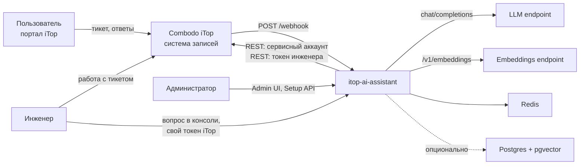
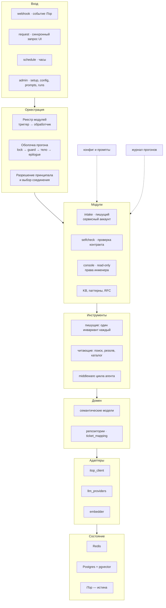
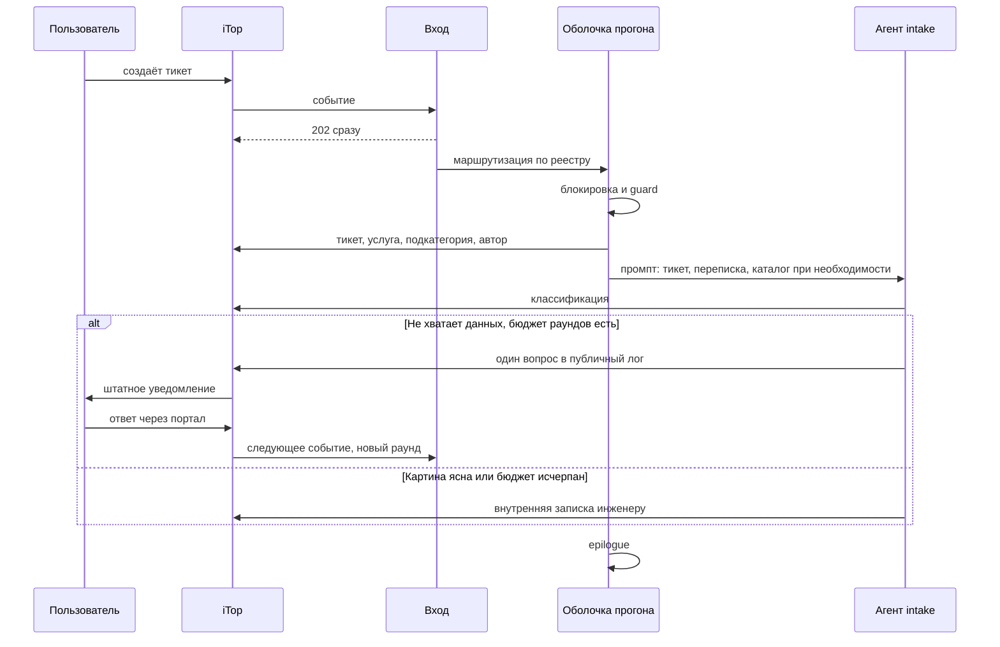
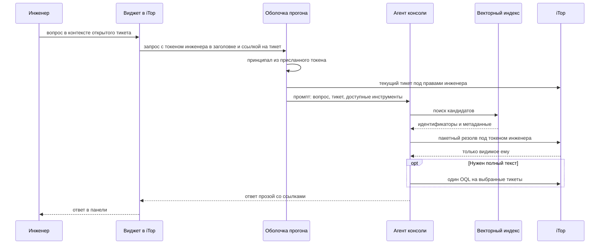

# itop-ai-assistant · Архитектура платформы

> Документ описывает архитектуру по фактическому состоянию репозитория `knowitop/itop-ai-assistant` и формализует швы, по которым платформа расширяется. Разделы 7–9 отделяют реализованное от целевого и содержат предложения к изменению текущего кода.

---

## 1. Что это

Middleware между пользователями и инженерами поверх Combodo iTop. iTop остаётся системой записей; сервис добавляет обработку в разрывы процесса, где сегодня человек делает работу вручную или не делает вовсе.

Реализованный сценарий — **intake**: перехват нового тикета по webhook, классификация по каталогу услуг, один уточняющий вопрос в публичный лог при необходимости, структурированная внутренняя записка инженеру. Изменения в самом iTop не требуются — триггеры и webhook сервис создаёт себе сам.

Платформа устроена так, чтобы intake был **первым модулем, а не единственным**. Всё дальнейшее описывает границы, которые это обеспечивают.

### Инварианты

Каждый реализован как код или структура, а не как инструкция в промпте.

| Инвариант | Как обеспечивается |
|---|---|
| iTop — единственный источник истины | Ничего доменного не кэшируется; тикет и переписка читаются заново на каждом событии |
| Сервис владеет только операционным состоянием | Redis: счётчики раундов, признак завершения, блокировка, оверрайды конфига, журнал прогонов |
| Действующее лицо всегда названо | Модуль работает под своим сервисным аккаунтом либо под токеном конкретного инженера — анонимных операций нет |
| Права наследуются, а не реализуются | Авторизацию исполняет iTop; middleware не имеет собственной модели доступа к доменным объектам |
| Правила держит код, не модель | Лимиты раундов, «один вопрос за прогон», «стоп, когда инженер взял тикет» — в guard и внутри инструментов; плохой вызов отклоняется через `ToolRejection` |
| Модель не может выдумать данные | Идентификаторы валидируются по каталогу; инструменты не видят сырой клиент iTop |
| Векторный индекс — источник кандидатов, не источник доступа | Любой результат поиска резолвится через iTop под правами запрашивающего |

Отдельно — **два рубежа от петли на собственных комментариях**: контексты триггеров iTop исключают `REST/JSON`, а guard останавливается, если последняя запись в публичном логе наша. Неверно настроенный триггер деградирует в no-op, а не в бесконечный цикл вопросов.

---

## 2. Контекст системы



| Внутри системы | Снаружи |
|---|---|
| Решения модулей, оркестрация прогона, применение правил | Хранение тикетов, каталога, прав, SLA |
| Журнал прогонов и трассы | Аудит изменений объектов (в iTop) |
| Провижининг триггеров и webhook | Настройка датамодели iTop |
| Маршрутизация к модели | Хостинг модели |
| Использование делегированного токена в пределах прогона | Выдача, хранение и отзыв токенов (iTop и сам инженер) |

---

## 3. Топология слоёв



### 3.1 Три типа триггера

Отличаются они не природой задачи, а тем, **куда уходит результат** и **кто ждёт ответа**.

| Тип | Инициатор | Ответ | Принципал | Пример |
|---|---|---|---|---|
| `webhook` | iTop | Асинхронно, в тикет | Сервисный аккаунт модуля | intake |
| `request` | UI инженера | Синхронно, вызывающему | Токен инженера | консоль |
| `schedule` | Часы | Асинхронно, в объект или в журнал | Сервисный аккаунт модуля | KB, паттерны, догоняющие прогоны |

Общее у них — снимок конфига, журнал прогона и гарантированное закрытие. Различия — доставка ответа и разрешение принципала. Это и есть аргумент за единый реестр триггеров вместо трёх параллельных механизмов.

Все три реализованы и идут через один реестр, одну рамку и один журнал — тип триггера и принципал записаны в прогоне и видны на экране Runs. Принципал у всех трёх сегодня один и тот же, сервисный: делегированный придёт с консолью, и менять для этого придётся только `api_deps.resolve_principal`. У `schedule` он сервисным и останется — у часов нет запроса, в котором мог бы приехать токен.

**Периодический ≠ триггер.** Фоновый цикл сам по себе не является триггером: индексатор тикает вечно, но у него нет ни модуля, ни субъекта, ни принципала, а журнал у него собственный (`index_journal` в Postgres). Он берёт из ядра только пейсинг (`pipelines/scheduler.py`) и в реестре не появляется. `schedule` — это способ начать прогон **бизнес-модуля** по часам, и разница между ним и инфраструктурным циклом ровно в том, что вокруг тика есть рамка прогона. Склеить их значило бы выдать индексатору синтетическое имя модуля и флаг «не журналить» — контракт, который он весь опровергает.

Оба вида циклов собираются в одном месте (`background.py`, одна строка на цикл) и живут под одним супервизором, который стартует и гасит их вместе с приложением.

### 3.2 Оболочка прогона

```
разрешение принципала   кто действует и под каким соединением
   ↓
lock                    защита от параллельной обработки одного объекта
   ↓
guard                   модуль-специфичные предикаты остановки
   ↓
чтение                  объект и его окружение из iTop
   ↓
тело                    агент или граф
   ↓
epilogue                закрыть прогон, который модуль не закрыл сам
```

Epilogue — не косметика. Модель может ответить прозой, выжечь бюджет итераций или зациклиться; без принудительного закрытия следующее событие переиграет весь цикл. Сбой модели превращается в деградацию, а не в повтор.

Оболочка живёт в ядре (`pipelines/shell.py`, `pipelines/agent_run.py`) и разделена на две половины по признаку потребителя. `TicketRun` — блокировка, чтение объекта, guard, тело, release; модуль отдаёт предикаты остановки и тело. `AgentRun` — цикл агента: трасса ходов в журнале, учёт расхода и то самое гарантированное закрытие. Вебхучному модулю нужны обе, синхронному (консоли) — только вторая, поэтому они **композируются, а не наследуются**: единый шаблонный метод заставил бы консоль глушить блокировку в no-op.

Триггер в контракт оболочки не входит: ей передаётся ссылка на объект, а не пейлоад вебхука, и она возвращает исход прогона. Поэтому один и тот же обработчик модуля обслуживает оба объектных типа — вебхук исход выбрасывает, синхронный вызов возвращает его вызывающему. Каждая остановка называет себя дважды одним и тем же текстом: шагом журнала и исходом, иначе синхронный вызывающий не узнал бы, почему ничего не произошло.

Оболочка нужна не всякому прогону: она про **объект** — блокировка, чтение, guard. Прогон по часам может быть не про объект вовсе, и тогда модуль пишет обычную корутину и берёт из ядра только рамку. Именно это и делает `selfcheck`.

Внешняя рамка прогона остаётся на входе: `journal.start`/`finish` и перехват исключений принадлежат тому, кто принял триггер (`pipelines/runner.py`). Поэтому исключения тела намеренно пробрасываются наружу — прогон открывается ровно один раз, а что значит сбой, решает вход: вебхук его логирует, запрос отдаёт вызывающему 500, планировщик логирует и продолжает тикать.

Разрешение принципала (первая строка схемы выше) живёт в ядре: прогон несёт контекст (`pipelines/context.py`) — идентификатор, модуль и принципала, — а входы получают принципала из одной функции (`api_deps.resolve_principal`). Оболочка берёт соединение уже «глазами» принципала, поэтому репозитории прогона физически не дотягиваются до сервисных креденшелов, и каждая операция несёт `comment` с именем модуля, идентификатором прогона и, при делегировании, именем инженера.

### 3.3 Модули: две формы

| Каталог | Форма | Когда |
|---|---|---|
| `agents/` | Единый цикл tool-calling, порядок выбирает модель | Задача плохо раскладывается в фиксированную последовательность |
| `graph/` | Явный граф, порядок задаёт код | Шаги известны и не должны меняться |

`intake` живёт в `agents/` не по умолчанию, а по результату A/B: детерминированный пятиузловой модуль решал ту же задачу и был удалён целиком, когда агент себя доказал. Это прецедент, а не правило — ревью RFC с обязательным набором проверок вполне может оказаться графом. Снаружи разница не видна: у обеих форм один контракт модуля.

**Границы между модулями** — три признака, совпадение двух означает отдельный модуль:

1. **Триггер** — другое событие, расписание или синхронный запрос.
2. **Принципал и права** — другой аккаунт или делегированные права пользователя.
3. **Промпт** — инструкции конфликтуют.

Консоль отличается по всем трём сразу, поэтому и является правильным вторым модулем.

### 3.4 Инструменты

Единственный способ модуля повлиять на мир. У каждого пишущего инструмента ровно один инвариант, проверяемый внутри — не в оркестрации. Иначе каждая новая точка вызова обязана помнить про ограничение, и однажды одна из них его забудет.

Пишущие инструменты intake:

| Инструмент | Инвариант | Завершает прогон |
|---|---|---|
| Установка классификации | оба идентификатора валидируются по каталогу | нет |
| Публичный вопрос | ровно один; счётчик раундов инкрементирует код | да |
| Передача инженеру | внутренняя записка и признак завершения | да |

Два приёма, переносимые на будущие модули:

**Набор инструментов — на прогон, а не фиксированный.** Инструменты классификации исчезают, когда тикет уже классифицирован, и тогда же из промпта уходит каталог. Иначе агент переклассифицирует на каждом событии и однажды заменяет верную подкатегорию другой. Отобрать инструмент надёжнее, чем попросить в промпте.

**Middleware вокруг цикла:** отклонение плохого вызова превращается в объяснение, что делать вместо; прогон заканчивается на терминальном инструменте; прозаический ход повторяется один раз; там, где эндпоинт это принимает, проза делается невозможной через форсированный `tool_choice`.

Здесь важно разделение: **что эндпоинт принимает — факт о соединении**, **применять ли — решение модуля**. Intake форсирует везде, где может, потому что его проза не доходит ни до кого. Консоль не форсирует ничего: проза и есть её выход.

### 3.5 Идентичность и доступ

Модуль объявляет, **от чьего имени** он работает. Режима три:

| Режим | Кто действует | Где берутся права | Модули |
|---|---|---|---|
| Сервисный аккаунт модуля | Именованная учётка iTop | Профиль этой учётки | intake, KB, фоновые |
| Делегированные права | Сам инженер | Его профиль в iTop | консоль |
| Без доступа к iTop | — | — | чисто вычислительные задачи |

Делегирование реализуется **токеном в запросе, а не токеном в хранилище**. Инженер генерирует персональный токен у себя в iTop, виджет присылает его в заголовке каждого обращения, middleware не сохраняет ничего. Следствия:

- **Токен — одновременно удостоверение и права.** Он резолвит сам себя (`Person WHERE id = :current_contact_id`), поэтому отдельный механизм идентификации не нужен. Своей модели доступа у сервиса нет и не планируется: единственная причина знать, кто пришёл, — обратиться в iTop от его имени.
- **Проверка прав не пишется.** Запрос выполняется под токеном инженера, невидимое ему не возвращается. Это не оптимизация, а отказ от целого класса ошибок.
- **Секретов пользователей middleware не держит.** Компрометация сервиса даёт только те токены, что проходят через него в этот момент; отзыв — дело инженера в iTop, нам делать нечего. Хранилище (§8.5) не снижает клиентский риск: чтобы виджет доказал, что он тот самый инженер, ему всё равно нужен эквивалентный секрет в браузере. Оно понадобится там, где живого запроса инженера нет вовсе — мессенджер, фоновые предложения от его имени.
- **Идентичность отвязана от канала доставки.** Токен не привязан к тому, что консоль встроена в страницу iTop: тот же механизм работает для мессенджера или отдельной страницы. Плагину iTop не нужна собственная криптография.

**Соединение и принципал — разные вещи.** Соединение (URL, версия API, таймаут) одно, а аутентификация в iTop REST задаётся **в каждом запросе**: `auth_user`/`auth_pwd` в форме, токен в заголовке `Auth-Token`. Поэтому один HTTP-пул законно обслуживает несколько личностей, а «работать под несколькими учётками одного iTop» — не отдельные соединения, а тот же самый механизм, что делегирование: другой токен в том же запросе.

**Действие агента должно быть отличимо от действия человека.** Под делегированным принципалом в истории объекта автором значится инженер, и без дополнительного следа нельзя понять, он это сделал сам или ИИ от его имени. Поэтому каждая операция прогона несёт `comment` — top-level поле payload iTop, попадающее в историю объекта: имя модуля, идентификатор прогона и, при делегировании, «от имени такого-то». Идентификатор в истории — тот же, по которому ищет экран Runs.

Правило про вектор — прямое следствие: индекс строится под сервисным аккаунтом и глобален, поэтому поиск даёт **кандидатов**, а фильтром служит резолв под токеном запрашивающего.

### 3.6 Домен и репозитории

Слой, который делает адаптацию к чужому iTop конфигом, а не патчем.

- Семантические модели без имён iTop: идентификатор подкатегории, автор, признак наличия услуги.
- Репозиторий тикетов — единственное место перевода семантики в атрибуты, управляемое секцией `ticket_mapping`: соответствие полей, переопределения по классам, список статусов, при которых сервису вообще позволено действовать.
- Репозиторий каталога — услуги и подкатегории; они практически не кастомизируются, поэтому классы фиксированы.

Инструменты не видят ни сырой клиент, ни имена атрибутов. OQL пишется через семантические плейсхолдеры.

Клиент iTop — **вендорённая внешняя библиотека**: ни одного импорта из приложения, функциональность не выпиливается под текущие нужды. Прикладная логика живёт в репозиториях.

### 3.7 Состояние

| Хранилище | Что | Обязательность |
|---|---|---|
| iTop | Тикеты, переписка, каталог, права | да |
| Redis | Состояние обработки объекта, блокировки, оверрайды конфига и промптов, журнал прогонов | да |
| Postgres + pgvector | Векторный индекс: эмбеддинги, идентификаторы, метаданные фильтров. **Сырого текста не хранит** | нет |
| Файлы | Дефолтные и переопределённые промпты | да |

Векторный слой — **инфраструктура, а не бизнес-модуль**: не регистрируется как модуль, не имеет промптов и маршрутов. Модули потребляют его через общие зависимости. Без строки подключения к Postgres подсистема полностью выключена и развёртывание остаётся Redis-only. Смена модели или размерности эмбеддингов даёт ошибку несовпадения отпечатка вместо смешивания несравнимых векторов.

### 3.8 Конфигурация и промпты

Приоритет: **рантайм-оверрайды в Redis → переменные окружения → `.env` → `config.yaml` → дефолты поля**.

Правки соединений и лимитов применяются со следующего прогона без перезапуска: бандл клиента кэшируется по отпечатку секций и пересобирается при изменении. Исключение зафиксировано честно: включение модуля и список его классов читаются на старте, потому что от них зависит построение реестра.

Промпты — файлы, не код. Дефолты в пакете, переопределение одноимённым файлом. Плейсхолдеры валидируются на старте: сломанный шаблон роняет загрузку, а не живой тикет. Исключение: **докстринги инструментов — это код**, они обязаны совпадать с сигнатурами и инвариантами.

Критерий полноты тикета берётся из **описания подкатегории в самом iTop**. Настройка поведения — работа администратора ITSM, а не разработчика; отсюда вопросы, специфичные для услуги.

### 3.9 Наблюдаемость

Журнал прогонов в Redis и экран Runs: статус, тип триггера, субъект, каждый ход модели, каждый вызов инструмента, финальный шаг с числом вызовов, токенами и временем. Запись нефатальна по замыслу.

Субъект прогона — «про что он». У объектных триггеров это ссылка на тикет, у прогона по часам — то, что модуль назвал сам: у `selfcheck` это он и есть. Поле называется субъектом именно потому, что тикетом оно быть не обязано.

Журнал фиксирует **принципала прогона** — метку, никогда не креденшелы. Чтение под токеном инженера в iTop почти не оставляет следов, и единственным местом, где видно «кто именно спрашивал», становится наш журнал. Обратная сторона того же: запись под токеном инженера следов оставляет слишком много и не тех — автором значится он, поэтому `comment` в истории объекта говорит, что действие совершил ассистент и от чьего имени, а идентификатор прогона в нём ведёт прямо на экран Runs.

---

## 4. Поток: обработка обращения



Многоходовый диалог получается бесплатно: история живёт в iTop и перечитывается на каждом витке. Сервис не хранит контекст диалога.

## 5. Поток: консоль инженера



Три свойства, ради которых поток выглядит именно так:

**Скоуп широкий, контекст узкий.** Искать можно по всему, что доступно инженеру; отправной точкой служит открытый тикет. Это разные вещи, и их разделение — то, что отличает полезную консоль от поиска общего назначения.

**Текст дочитывается порциями, а не сохраняется.** По умолчанию агент оперирует ссылками; полный текст запрашивается одним OQL на набор идентификаторов, когда он действительно нужен. Кэш сниппетов не появляется, инвариант «не дублируем данные iTop» остаётся абсолютным.

**Модуль не имеет пишущих инструментов вовсе.** Это свойство учётной записи и набора инструментов, а не обещание в промпте.

---

## 6. Точки расширения

Один и тот же приём во всём проекте: **реестр плюс одна строка регистрации**.

| Что добавляем | Куда | Что не трогаем |
|---|---|---|
| Бизнес-модуль | Пакет модуля с регистрацией + строка в сборке реестра + секция конфига | Вход, инструменты других модулей |
| Расписание для модуля | Маршрут в его же регистрации; период — поле его конфига | Планировщик, супервизор |
| Инфраструктурный цикл | Строка в сборке фоновых задач | Реестр триггеров, журнал прогонов |
| Инструмент | Модуль-владелец: один инвариант внутри | Оркестрацию |
| Источник для индекса | Файл источника + строка в его реестре | Весь векторный слой |
| LLM-провайдер | Запись в реестре провайдеров + пакет интеграции | Код агентов |
| Поддержка чужой датамодели | Секция соответствия полей | Код |
| Правка поведения | Промпт-файл или админский API | Код |
| Экран модуля в админке | Метаданные модуля подхватываются UI | UI |

Четыре уровня кастомизации развёртывания, от дешёвого к дорогому:

1. **Каталог iTop** — описание подкатегории задаёт, что агент обязан выяснить. Уровень администратора ITSM.
2. **Конфиг** — лимиты, модель модуля, набор классов, состав модулей.
3. **Промпты** — язык, тон, доменная специфика.
4. **Свой модуль или источник** — через контракты, без форка ядра.

---

## 7. Внешние интерфейсы

| Интерфейс | Направление | Аутентификация |
|---|---|---|
| Приём событий iTop | вход | Общий секрет |
| Setup и админский API | вход | Токен администратора; до установки открыт |
| Консоль | вход | Личный токен iTop инженера в заголовке каждого запроса — он же удостоверение, он же права |
| Админский SPA и OpenAPI | вход | Токен в браузере |
| iTop REST | выход | Сервисный аккаунт или токен инженера |
| Модель и эмбеддинги | выход | Ключ провайдера |

Пробы в мастере настройки заслуживают упоминания как решение: проверка модели не просто дёргает эндпоинт, а привязывает пробный инструмент и вызывает его, форсируя выбор инструмента, если секция утверждает, что эндпоинт это принимает. Модель, не умеющая в tool calling, отваливается в мастере, а не на первом живом тикете. Проверка эмбеддингов меряет реальную размерность вектора и сравнивает с заявленной.

---

## 8. Предложения к изменению текущего кода

Порядок продиктован тем, что следующий модуль — консоль инженера.

**8.1 Вынести оболочку прогона в ядро. — Сделано.** Блокировка, чтение объекта, шаги журнала и гарантированное закрытие переехали в `pipelines/shell.py` (`TicketRun`) и `pipelines/agent_run.py` (`AgentRun`); intake отдаёт предикаты guard, тело и свой epilogue. Разрешение принципала осталось за §8.2 — оно требует именованных соединений, которых ещё нет.

**8.2 Ввести принципала прогона. — Сделано.** Личность прогона перестала подразумеваться: `Principal` (`principal.py`) — сервисный или делегированный, `RunContext` несёт его вместе с идентификатором и модулем, а `ItopProvider.for_principal` отдаёт бандл, собранный поверх view соединения. Сервисный принципал не носит собственных креденшелов — он означает «своими креденшелами соединения», поэтому шаг не завёл ни одного нового секрета. Токен не попадает ни в `repr`, ни в лог, ни в журнал: наружу выходит только метка.

Модуль режим пока не объявляет: у всех сегодня один и тот же принципал, и объявлять нечего до появления второго. `resolve_principal` (`api_deps.py`) — та единственная функция, которая изменится, когда консоль начнёт присылать токен инженера, а вебхук — учётку, под которой его обрабатывать.

Именованных системных соединений и пула клиентов по принципалу — **не нужно, и это отдельное решение, а не упрощение**. Аутентификация iTop REST задаётся в каждом запросе (`auth_user`/`auth_pwd` в форме, токен в заголовке `Auth-Token`), поэтому HTTP-пул к личности не привязан вовсе: одно соединение, аутентификация — параметр запроса. Кэш бандла остаётся по отпечатку секций, потому что он про **соединение**; принципал накладывается сверху лёгким view поверх того же пула. Работать под несколькими учётками одного iTop — тот же механизм, что делегирование, а не второй.

Ровно поэтому же атрибуция обязана быть внутри клиента, а не в оркестрации: `Schema.update` рекурсивно вызывает себя, `sync` зовёт `update`, а `lookup` уходит за внешними ключами отдельным запросом. Передавай аутентификацию параметром — и забытый форвард в `lookup` тихо разрешит чужие ключи под сервисной учёткой. У view подчинённые вызовы наследуют принципала по построению.

**8.3 Расширить реестр до трёх типов триггера. — Сделано.** Реестр разделён на две сущности, которые раньше были слиты в одном классе: `ModuleInfo` — что такое бизнес-модуль (конфиг, промпты, экран в админке), маршруты — что может начать прогон. Оболочка получает `ObjectRef` вместо webhook-пейлоада и возвращает `RunOutcome`, поэтому один и тот же `<Run>.handle` служит обоим объектным типам: вебхук исход выбрасывает, синхронный вызов возвращает его вызывающему. Внешняя рамка прогона стала общей (`pipelines/runner.py`), и каждый вход сам решает, что значит сбой: вебхук его логирует (его вызывающий — iTop, уже получивший 202), запрос отдаёт 500, планировщик логирует и тикает дальше. Потребители: `POST /api/modules/intake/process` (тот же прогон intake по одному тикету, запущенный руками; guard не обходится — на завершённом тикете честный `skipped`) и модуль `selfcheck` с маршрутами обоих типов.

Третий тип потребовал развести два механизма, которые до этого выглядели одним (см. §3.1): пейсинг фоновых циклов — инфраструктура (`pipelines/scheduler.py` плюс сборка в `background.py`), `schedule` — триггер бизнес-модуля (`schedule/runner.py`). Индексатор переехал под супервизор и потерял собственные `start`/`stop`; заявка на полный бэкфилл переехала из памяти процесса в строку `vector_sync_state`, отчего `POST /api/vector/reindex` наконец работает и при нескольких репликах. В реестре индексатора нет и не будет.

Принципал у всех трёх типов есть (§8.2), но пока сервисный: делегированный придёт с консолью, а `request` до тех пор закрыт админским токеном.

**8.4 Разделить инварианты на два яруса.** Платформенные — не писать, когда инженер взял объект; не реагировать на собственный комментарий; не более одной записи в публичный лог за прогон — переехать в оболочку. Специфичные остаются внутри инструментов. Иначе новый модуль со своими инструментами их просто не унаследует, и никто не заметит, пока в публичном логе не появится второй голос.

**8.5 Хранилище делегированных токенов. — Отложено, с условием возврата.** Пока токен приходит в каждом запросе (§3.5), хранилище не нужно: оно не убирает секрет из браузера, зато добавляет склад чужих секретов, ключ шифрования, жизненный цикл ввода/проверки/отзыва и экран управления. Вернуться, когда появится канал **без живого запроса инженера** — мессенджер, фоновые предложения от его имени, отложенная задача: там предъявить токен некому. Требования на тот момент прежние: шифрование ключом развёртывания, ключ не рядом с шифротекстом, понятная ошибка при отзыве. Это будет первый секрет пользователя в системе — обращаться с ним как с конфигом нельзя.

**8.6 Принципал в журнале прогонов. — Сделано.** Поле в прогоне и колонка на экране Runs; прогоны, записанные до появления поля, читаются как сервисные и доживают свой TTL рядом с новыми. В журнал идёт метка, не креденшелы.

**8.7 Отложено осознанно.** Неймспейс состояния по модулю (`ai_done` — глобальный флаг, что станет ложью с несколькими модулями на одном тикете) не нужен консоли, которая состояния на тикете не держит. Вернуть к моменту KB-модуля.

---

## 9. Открытая развилка: предложения AI

Принцип «уверен и обратимо — делает сам, иначе предлагает» реализован пока только автономной половиной: обратимые действия выполняются, необратимые не выполняются.

Консоль вторую половину почти не требует: read-only агент ничего не пишет, а черновик ответа, который инженер копирует руками, артефактом не является.

**Критерий, по которому решение станет обязательным, — разрыв во времени между генерацией и решением.**

| Разрыв | Пример | Где хранить |
|---|---|---|
| Секунды, одна сессия | Консоль предложила действие, инженер тут же применил | Redis с TTL |
| Дни, разные люди | Фоновый модуль сгенерировал черновик статьи, инженер смотрит через неделю | Долговечное хранилище |

Во втором случае очередь на ревью — доменный объект с жизненным циклом, и выбор между Postgres и собственным классом в iTop стоит делать вместе с KB-модулем, а не раньше. Аргумент за iTop: предложение о тикете — доменное состояние, там оно переживает переустановку middleware и попадает в общий аудит. Аргумент за Postgres: не требует плагина и не засоряет датамодель заказчика.

Что решено уже сейчас: **предложение — законченный артефакт, а не приостановленный прогон.** Пауза агента конфликтует с «iTop — истина»: за время ожидания объект изменился, и восстановленный чекпоинт опирается на устаревшую картину.

---

## 10. Компромиссы

| Решение | Цена | Почему |
|---|---|---|
| Stateless, iTop как истина | Лишние чтения на каждом событии | Расхождение состояний дороже запросов |
| Агент вместо графа в intake | Меньше предсказуемости хода | Выиграл A/B у детерминированной реализации той же задачи |
| Инварианты в инструментах | Дублирование проверок между модулями | Нарушение правила невозможно, а не маловероятно |
| Делегированный токен в каждом запросе | Токен ходит по сети постоянно и живёт в браузере; каналы без живого запроса инженера так не обслужить | Права наследуются от iTop, своей модели доступа не нужно, и middleware не становится складом чужих секретов |
| Резолв вместо кэша сниппетов | Задержка на дочитывание | Дублирования данных iTop не возникает вовсе |
| Postgres опционален | Часть возможностей недоступна в Redis-only | Порог входа: подъём одной командой |
| Свой журнал вместо внешнего трейсинга | Меньше аналитики | Смотрит администратор развёртывания, а не разработчик |
| Минимализм фронтенда | Ручная работа вместо библиотек | Поддерживается не фронтендером |

Что пересматривать при росте:

- Фоновая задача в процессе приложения → очередь, когда понадобятся ретраи, приоритеты и контроль параллелизма. Там же решается и межрепличность: сегодня цикл живёт **в каждом процессе**, и исключение — дело самого тика (у sweep'а это advisory-lock в Postgres). Первый schedule-модуль, которому нельзя отработать дважды, потребует выбора лидера.
- Один процесс → отдельные процессы, когда фоновая аналитика начнёт мешать интерактивной обработке.
- Токен в запросе → хранилище делегированных токенов (§8.5), когда появится канал без живого запроса инженера; и дальше → OAuth-подобная схема, если понадобятся ротация и централизованный отзыв.
- Оверрайды конфига в Redis → БД, если появятся несколько развёртываний с общим управлением.

---

## 11. Статус

| Компонент | Статус |
|---|---|
| Оболочка прогона: блокировка, guard, epilogue | реализовано, в ядре |
| Реестр триггеров и метаданные для UI | реализовано: webhook, request, schedule |
| Супервизор фоновых циклов | реализовано, в ядре |
| Модуль intake | реализовано |
| Модуль selfcheck (проверка контракта модуля) | реализовано, выключен по умолчанию |
| Доменная модель и соответствие полей | реализовано |
| Реестр LLM-провайдеров, пробы соединений | реализовано |
| Мастер настройки, провижининг iTop | реализовано |
| Журнал прогонов и экран Runs | реализовано: тип триггера, субъект и принципал |
| Векторная инфраструктура и индексатор | реализовано, опционально, под супервизором |
| Оболочка прогона в ядре, контракт модуля | реализовано, §8.1 |
| Три типа триггера на одном реестре | реализовано, §8.3 |
| Принципал прогона и атрибуция действий | реализовано, §8.2 и §8.6 |
| Делегированные права инженера | ждёт консоли: механизм готов, токен приезжает в запросе |
| Консоль инженера | следующий модуль |
| Обогащение полей сверх классификации | не реализовано |
| Артефакты предложений | решается вместе с KB-модулем |
| KB, паттерны, ревью RFC, память по пользователю | план |