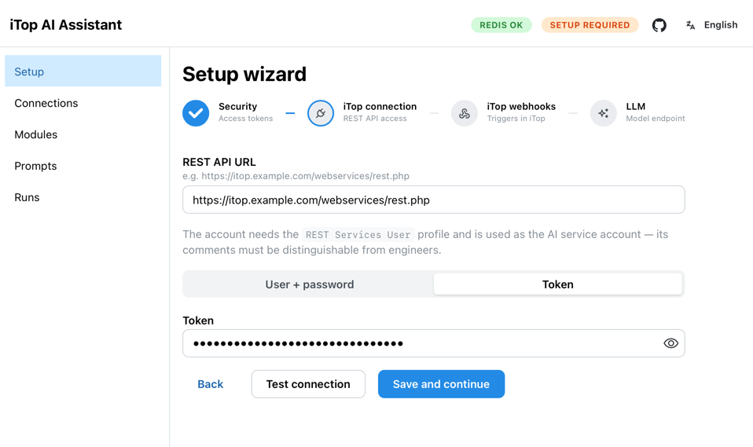

# Setup

This page covers everything needed to get the assistant running: the built-in setup wizard and, as an alternative, manual iTop configuration.

## Setup wizard

The wizard opens automatically at `http://localhost:8001/ui` when the assistant is not yet configured. It walks through four steps and tests each connection before moving on.

> [!IMPORTANT]
> **Before starting the wizard**, create the AI service account in iTop manually — the wizard does not do this. See [Create a service account](#1-create-a-service-account) below.



### Step 1 — Security

Set two tokens — either type your own or click **Generate** to create a cryptographically random value. **Copy and save both tokens before leaving this screen** — they are not shown again.

- **Webhook Token** — a shared secret the assistant requires in every request from iTop (`X-Auth-Token` header). Protects the webhook endpoint from unauthorized calls.
- **Admin Token** — a bearer token for the admin UI and API (`Authorization: Bearer`). Until it is set, the admin API is open to anyone on the network (first-run mode); the wizard closes that by saving the token. **Save this token** — you will need to enter it every time you open the admin UI.

### Step 2 — iTop connection

Enter the iTop REST API URL and the credentials of the AI service account you created in the prerequisite step:

- **REST API URL** — typically `http://your-itop/webservices/rest.php`
- **Auth method** — application token (recommended) or username + password

Click **Test connection** to verify before saving. The test returns the login name of the service account — confirm it matches the account you created.

### Step 3 — iTop webhooks

This step creates the triggers and webhooks in iTop automatically, using one-time admin credentials (entered here, never stored). The assistant creates:

| Object | Purpose |
|--------|---------|
| `RemoteApplicationConnection` | iTop connection config for the assistant |
| `TriggerOnObjectCreate` (UserRequest, Incident) | Fires when a new ticket is created |
| `TriggerOnObjectUpdate` (UserRequest, Incident) | Fires when a user posts to the public log |
| `ActionWebhook` × 2 | Sends `POST /webhook` for each trigger |

Objects that already exist (matched by name) are left untouched — re-running is safe. You can skip this step and create the iTop objects manually (see below).

> [!IMPORTANT]
> The **Backend URL** field (auto-filled from the browser) must be the address at which the iTop server can reach the assistant — not necessarily `localhost`. In Docker Compose, that is `http://assistant:8000`.

### Step 4 — LLM connection

Enter your LLM endpoint details:

- **Base URL** — the OpenAI-compatible endpoint (see [Configuration → LLM providers](configuration.md#supported-llm-providers))
- **Model** — the model name exactly as the endpoint exposes it
- **API key** — optional; omit for local LM Studio

Click **Test LLM** to verify the model responds before saving.

Once all four steps are complete, `/webhook` becomes active and iTop will start sending tickets to the assistant.

---

## iTop configuration

If you skipped Step 3 of the wizard, or need to understand what was created, here is the full manual setup.

### 1. Create a service account

Create a dedicated iTop user account for the assistant (**Administration → User accounts**). Use **Application Token** authentication — no password needed.

The account needs the following profiles:
- **REST Services User** — for API access
- **Service Desk Agent** or equivalent — for read access to tickets and the ability to post to logs

All comments posted by the assistant will appear under this account name, making AI actions visible and auditable in the ticket log. Use this account's token for `ITOP_TOKEN` (or `ITOP_USER` / `ITOP_PWD`) in your `.env`.


### 2. Configure service subcategories

The assistant uses the **description** field of each service subcategory as its completeness criteria — it checks whether the ticket contains everything listed there before deciding to ask a question or proceed to enrichment.

Go to each subcategory you want the assistant to handle and write a short description of what information is required:

> Hardware equipment failures and malfunctions.  
> Required information: device manufacturer and model, operating system, exact error message or failure symptom.

Keep it factual and specific — the more precise the description, the better the questions the assistant will ask.

### 3. Create triggers

Create two triggers in iTop (**Configuration → Notifications → Triggers**):

**Trigger 1 — ticket created:**

| Field        | Value                        |
|--------------|------------------------------|
| Type         | Trigger (on object creation) |
| Target class | `UserRequest`                |
| Context      | `cron`, `Console`, `Portal`  |

**Trigger 2 — user commented:**

| Field         | Value                       |
|---------------|-----------------------------|
| Type          | Trigger (on object update)  |
| Target class  | `UserRequest`               |
| Context       | `cron`, `Console`, `Portal` |
| Target fields | `public_log`                |

> [!IMPORTANT]
> Set **Context** to `cron`, `Console`, and `Portal` only — **do not include `REST/JSON`**. This prevents the trigger from firing when the assistant itself posts a comment via the API, which would cause an infinite loop.


### 4. Create webhooks

In iTop, go to **Configuration → Notifications → Remote Application Connections** and create a connection for the assistant. If you set a `WEBHOOK_TOKEN`, configure the connection to send it in the `X-Auth-Token` header.

For each trigger, create a **Webhook action** that sends a `POST` to the assistant:

**Webhook 1 — ticket created** (`POST http://assistant:8000/webhook`):
```json
{"id": "$this->id$", "class": "$this->finalclass$", "event": "created"}
```

**Webhook 2 — user commented** (`POST http://assistant:8000/webhook`):
```json
{"id": "$this->id$", "class": "$this->finalclass$", "event": "user_commented"}
```


### Automated provisioning (CLI)

The same iTop objects can be created via the CLI — useful for scripted deployments:

```bash
# from a local checkout
cd assistant && PYTHONPATH=src uv run python -m itop_provisioning \
  --itop-url http://localhost:8000/webservices/rest.php --user admin \
  --backend-url http://assistant:8000 --webhook-token <WEBHOOK_TOKEN>

# or inside the Docker stack
docker compose exec assistant python -m itop_provisioning \
  --itop-url http://itop/webservices/rest.php --user admin \
  --backend-url http://assistant:8000 --webhook-token <WEBHOOK_TOKEN>
```

`--backend-url` is the assistant URL **as reachable from the iTop server** (in the bundled compose stack, that is `http://assistant:8000`).
